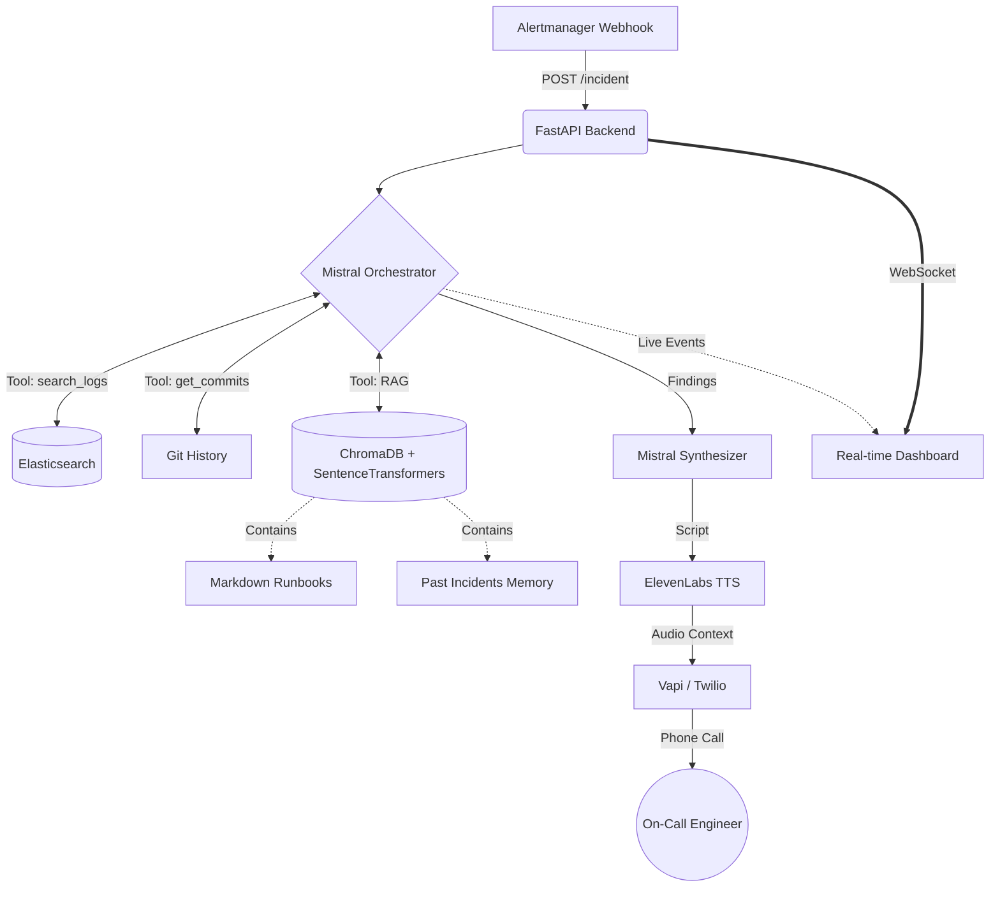

<div align="center">
  

  <h1>🛡️ Vigil</h1>
  <p><b>Autonomous AI Incident Response Agent</b></p>
  <p><i>An intelligent SRE agent that investigates production alerts, searches logs & commits, finds similar past incidents, and briefs the on-call engineer via voice call.</i></p>
</div>

---

## 🚀 Overview

Vigil is an autonomous Level-1 Site Reliability Engineering (SRE) agent designed to slash Time-To-Resolution (TTR) for production incidents. 

When an alert fires, Vigil doesn't just page you—it **investigates**. It autonomously searches logs, analyzes recent deployments, checks runbooks, and cross-references past incidents. It then calls the on-call engineer via phone, provides a spoken briefing of the root cause, and allows the engineer to ask follow-up questions conversationaly.

## ✨ Features Implemented So Far

### 1. Alerting Infrastructure (Phase 1)
- Complete 9-service Docker Compose stack simulating a real production environment.
- Promtail + Loki / Elasticsearch + Logstash for centralized logging.
- Prometheus + Alertmanager for metrics and alerting.
- Seeded Flask application that randomly generates 5xx errors, DB connection failures, and CPU spikes to trigger alerts.

### 2. Autonomous Investigator Agent (Phase 2)
- Built on **Mistral Large 3** via NVIDIA API with native tool-calling.
- Agent loop autonomously decides which tools to use to find the root cause.
- **Tools Included:**
  - `search_logs`: Queries Elasticsearch for error patterns.
  - `get_recent_commits`: Checks recent GitHub/GitLab commits for breaking changes.
  - `search_runbooks`: RAG (Retrieval-Augmented Generation) search over Markdown runbooks using ChromaDB.
  - `search_past_incidents`: Semantic search for similar historical incidents.

### 3. Real-Time Dashboard UI (Phase 3)
- Custom-built, dark-themed FastAPI dashboard at `localhost:8000`.
- **WebSocket Event Bus:** Watch the agent's thought process and tool calls in real-time as they happen.
- "Trigger Test Incident" buttons (5xx, DB Down, CPU Spike) to instantly launch investigations.
- Expandable incident cards showing severity, status, root cause, and the full timeline.

### 4. Voice Calling & Conversational Q&A (Phase 4)
- Integrates with **ElevenLabs** for ultra-realistic TTS (Text-to-Speech) and STT (Speech-to-Text).
- Synthesizer agent condenses the investigation findings into a 30-second spoken briefing.
- `POST /incident/{id}/ask` endpoint allows conversational follow-up questions. The Mistral agent answers using the full context of the investigation.

---

## 🏗️ Architecture



---

## ⚙️ Setup & Installation

### Prerequisites
- Docker & Docker Compose
- [NVIDIA API Key](https://build.nvidia.com/) (For Mistral LLM)
- [ElevenLabs API Key](https://elevenlabs.io/) (For TTS Context generation)

### 1. Configure Environment
Create a `.env` file in the root directory:
```bash
MISTRAL_API_KEY=nvapi-...
ELEVENLABS_API_KEY=sk_...
```

### 2. Start the Stack
Bring up the entire infrastructure (Postgres, Prometheus, Alertmanager, FastAPI, etc.):
```bash
docker compose up -d --build
```
*Note: The first build will download a CPU-only version of PyTorch for ChromaDB, which takes a few minutes but saves significant image size.*

### 3. Open the Dashboard
Navigate to `http://localhost:8000` in your browser.

---

## 🧪 How to Test It

1. **Trigger an Alert:** Click one of the trigger buttons (e.g., "5xx Error Spike") on the dashboard.
2. **Watch the Agent:** The dashboard will instantly show the incident. Expand the card to watch the Mistral agent autonomously query logs, commits, and runbooks via WebSocket events.
3. **Review the Findings:** Once complete, the agent will display the root cause, suspicious commit, and a generated voice briefing.
4. **Ask Questions:** Use the `/incident/{id}/ask` API endpoint to ask the agent follow-up questions about what it found.

---

## 🛣️ Roadmap / Next Steps

- **Phase 5 (In Progress):** Vapi voice agent integration to orchestrate the actual Twilio outbound phone call.
- **Phase 6:** Autonomous Remediation (Agent can execute safe rollback scripts).
- **Phase 7:** Slack/Discord bot integration for teams who prefer chat over voice calls.
